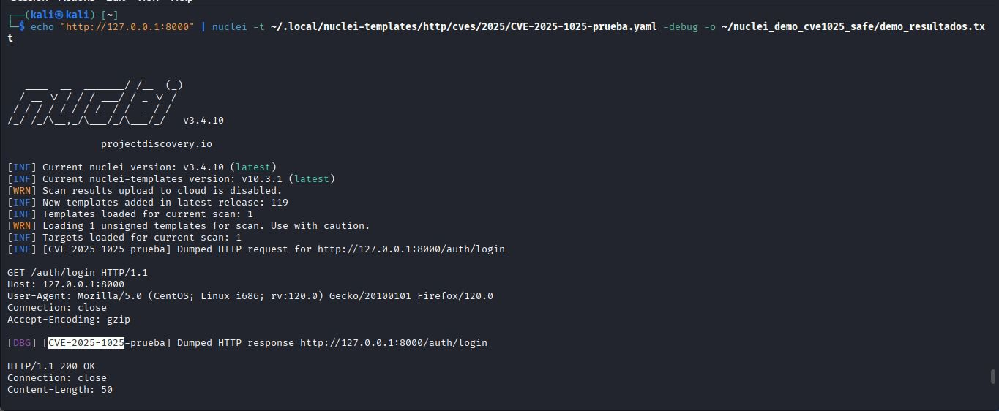
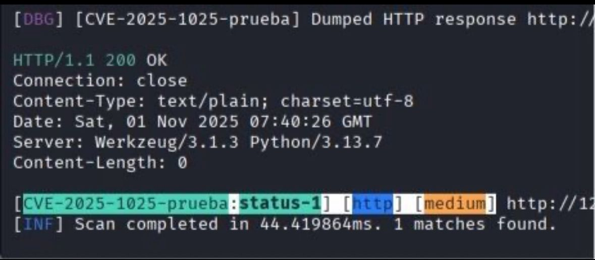

# nuclei-template-Lab
# CVE-2025-1025 — Plantilla Prueba para Nuclei



**Lectura de la plantilla**  



ID y nombre → Identificación del template.

Severidad → medium, solo de prueba.

Descripción → Indica que no es intrusivo.

Tags → Ayudan a filtrar/categorizar en Nuclei.

POST /assets/upload → Sube un archivo .txt con contenido aleatorio (marker).

Matcher → Confirma que la subida fue correcta.

Extractor → Obtiene la ruta del archivo subido (upload_path).

GET /storage/uploads/{{upload_path}} → Accede al archivo subido.

Matchers →

Comprueba que el HTTP status sea 200.

Verifica que el contenido incluya el marker aleatorio.

**Descripción**  
Plantilla **sanitizada** y de demostración (CVE-2025-1025) para uso educativo con Nuclei. Esta plantilla simula un flujo *login → upload → verify* y **no** contiene PoC explotables. Pensada para entornos de prueba o laboratorios.

**Advertencia / Uso responsable**  
Ejecuta esta plantilla **solo** contra sistemas que tengas permiso para evaluar (laboratorio, máquinas propias o programas de bug bounty autorizados). No escanees sistemas ajenos. No publiques evidencia sensible ni URLs reales.

## Requisitos (Kali / Ubuntu / WSL)
- Nuclei instalado (v3.x recomendado)
- Plantillas clonadas (si quieres usar otras)
- Conexión a terminal con permisos adecuados

## Cómo ejecutar (ejemplo)
```
# instalar nuclei si no lo tienes
curl -sSfL https://raw.githubusercontent.com/projectdiscovery/nuclei/v3/cmd/nuclei/install.sh | bash
sudo mv nuclei /usr/local/bin/

# ejecutar la plantilla contra un objetivo de PRUEBA
echo "http://localhost:8000" | nuclei -t ~/.local/nuclei-templates/http/cves/2025/CVE-2025-1025-prueba.yaml -debug -o ~/nuclei_demo_cve1025_safe/demo_resultados.txt

```
¿Qué hace la plantilla?
Simula petición de login.

Simula subida de archivo con un marker aleatorio y comprueba que sea accesible luego.

Devuelve coincidencia si el servidor responde con los indicadores definidos en matchers.

Buenas prácticas antes de ejecutar:
Revisa el YAML para entender requests, matchers y extractors.

### Leer más: https://www.linkedin.com/posts/imane-l_cybersecurity-ciberseguridad-nuclei-activity-7391075893240213504-mnPI?utm_source=share&utm_medium=member_ios&rcm=ACoAAEQbOa0BWJkvrbiZ2GDZTNkoerFhzSvWnCQ


